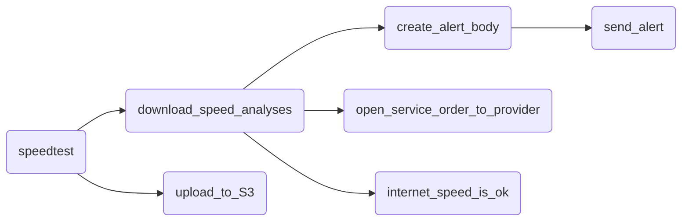

# Sobre o projeto
Consiste em um DAG (Directed Acyclic Graphs) que implementa um fluxo de tarefas (tasks) desenvolvidas em **python** a serem orquestradas e executadas no **Apache Airflow** com o objetivo de reunir **dados** acerca da qualidade da internet fornecida pelo provedor e emitir alertas quando o serviço atingir níveis críticos de qualidade.

# Graph

# Tasks

**Speedtest - PythonOperator**
- Esta tarefa é responsável por utilizar a api do Speedtest.net para medir a velocidade de download e upload.

**upload_to_s3 - S3CreateObjectOperator**
- Cria um arquivo a partir da leitura realizada na task anterior e faz o upload do arquivo para o armazenamento em nuvem da AWS (**Amazon S3**)

**download_speed_analyses - BranchPythonOperator**
- Utiliza a velocidade de download medida para determinar qual o fluxo de tasks deverá ser seguido. Se a velocidade estiver abaixo do esperado seguirá para as tasks open_service_order_to_provider ou create_alert_body, resultando em um alerta para que os responsáveis realizem uma ação.

**internet_speed_is_ok - EmptyOperator**
- Uma task vazia utilizada para confirmar o a continuidade do processo no fluxo correto.

**open_service_order_to_provider - EmptyOperator**
- Uma task vazia utilizada para confirmar o a continuidade do processo no fluxo correto. No futuro será expandida para contemplar a ação a ser seguida em caso de a medição ser abaixo do que determina a lei.

**create_alert_body - EmailOperator**
- Cria, a partir do dados medidons na task speedtest, um texto padrão para compor o email de alerta enviado.

**send_alert - PythonOperator**
- Envia um email com informações sobre a velocidade da internet. 

# Skills and Technical Knowledge: 

**Skills and Technical Knowledge:**
- Containerization (Docker)
- Data Lake Creation
  
**Orchestration Tools:**  
- Apache Airflow  
  
**Programming Languages:**  
- Python
- Git  
  
**Cloud Computing Tools:**  
- Amazon Web Services - S3
